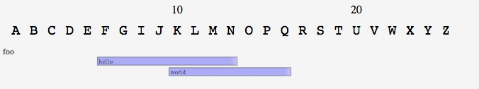
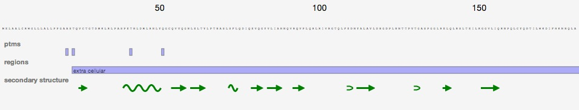
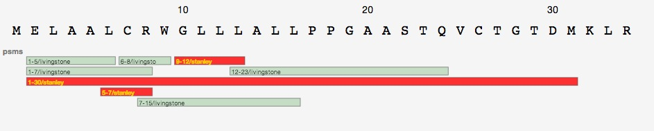
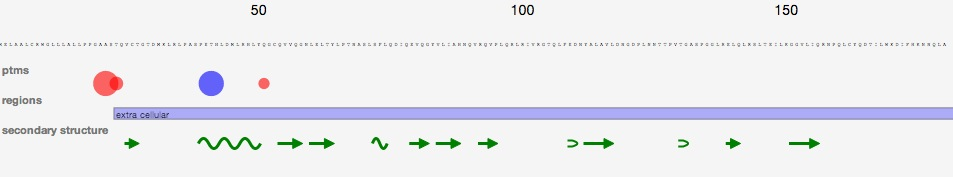
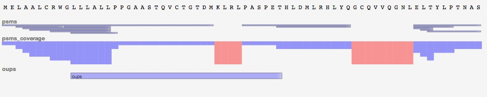
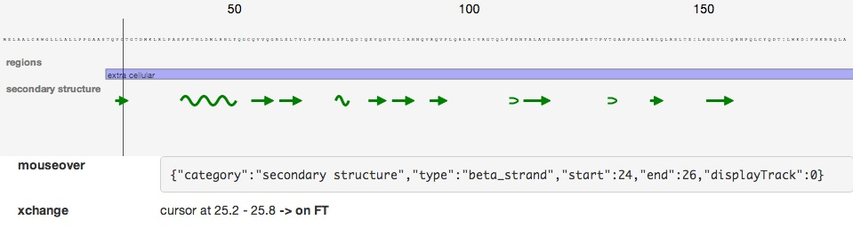
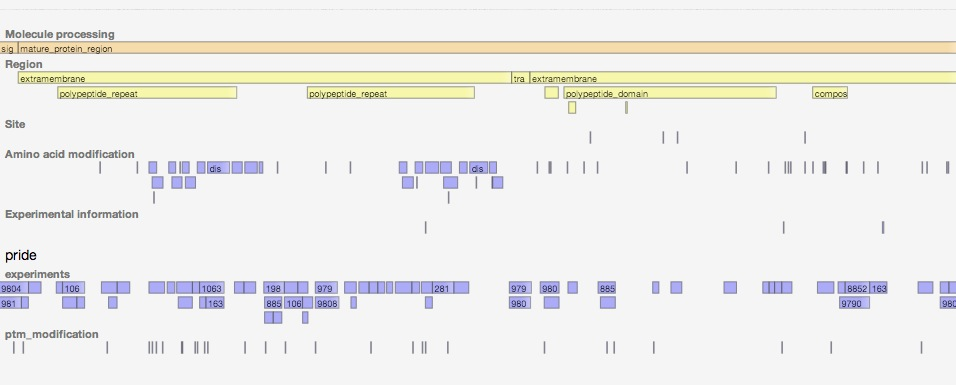
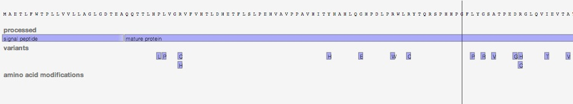
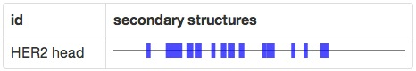
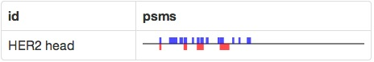

#pViz.js: a dynamic JavaScript & SVG library for visualization of protein sequence features

##Head straight for working examples and demo applications [here](http://research-pub.gene.com/pviz/examples/)
##What is pViz.js?
pViz.js is a <strike>protein</strike> sequence features viewer for modern browsers, based on a JavaScript library, SVG and css.

Given sequence and a list of positioned features, it displays the sequence and the features aligning them on the sequence.
Features are layed out not to overlaying each other, allowing zooming, interaction and a decent amount of customization.

Default sources can be explicitly defined in JavaScript (limit is the sky),  [DAS servers](http://en.wikipedia.org/wiki/Distributed_Annotation_System), [PEFF](http://www.psidev.info/node/363) (PSI extended Fasta format) or a mix of them.

**Warning!** pViz target modern browsers, such as Firefox, Chrome and Safari. Do not expect it to work on IE7, just upgrade.

##Hello World
To create a basic pViz application, download `pviz-bundle.min.js` and `pviz-core.css` from [github](https://github.com/Genentech/pviz/tree/master/dist) beside a file containing the following html content. Open this file in your browser... Et voilà.

    <head>
      <link rel="stylesheet" type="text/css" href="pviz-core.css">
      
    </head>
    <body>
      

      
    </body>

**The rendered features. In practice, the widget is zoomable**

##How does it works?
###Principles
A <code>SeqEntry</code> object contains a sequence, a list of features (and whatever you may find convenient for later display).

###Structure

Features are add to the model (if the view is already instanciated, it will be updated once the features are received, thanks to backbone.js).
A feature is an JavaScript object (a plain hashmap, though), containing several fields

 * **groupSet [optional]:** a group of categories information,allowing to have features with the same category name, to be regrouped at first into the same meta-group;
 * **category:** all features from the same category will be handled in the same layer;
 * **categoryType [optional]:** has not grouping purpose, but allows to define properties among different categories (track height, css);
 * **type:** within a category, features can have different types, offering the possibility for custom render (basic is just a rectangle) or interaction;
 * **start:** starting position (0 is the first amino acid of the sequence);
 * **end:** an inclusive end position;
 * **text [optional]:** text to be be displayed in the default rectangle;
 * Whatever you may need for customized display or interaction.

###Third parties dependencies
pViz library uses [D3](http://d3js.org) for SVG generation, [backbone.js](http://backbonejs.org) framework for the model/view framework, [Twitter Bootstrap](http://getbootstrap.com/) for the css, [underscore.js](http://underscorejs.org) library for convenient utilities, and [require.js](http://requirejs.org) for dependency management.

But do not worry, including the [packaged distribution](dist/pviz-bundle-min.js) bundles all of them for you.

##Examples
###The working examples and demo applications can be found [here](http://research-pub.gene.com/pviz/examples/).

Easier than a full documentation, we bring some demonstration use cases:
<table style="border-spacing: 0px">
	<tr>
		<td style="text-align:center;padding: 20px;border: 1px solid #999;"><a href="examples/example-0.html"> 2 categories, a few features and an interactive view</a></td>
		<td style="text-align:center;padding: 20px;border: 1px solid #999;"><a href="examples/example-custom-display-css.html"> css depending on category and feature type</a></td>
	</tr>
	<tr>
		<td style="text-align:center;padding: 20px;border: 1px solid #999;"><a href="examples/example-custom-display.html"> drawing special ideograms depending on the feature type</a></td>
		<td style="text-align:center;padding: 20px;border: 1px solid #999;"><a href="examples/example-different-track-heights.html"> getting more of less extend tracks depending on the category</a></td>
	</tr>
	<tr>
		<td style="text-align:center;padding: 20px;border: 1px solid #999;"><a href="examples/example-interaction.html"> mouse over, click etc. some feature to see more happen</a></td>
		<td style="text-align:center;padding: 20px;border: 1px solid #999;"><a href="examples/example-das-reader.html"> loading sequence & features from EBI/Uniprot DAS server in an interactive view</a></td>
	</tr>
	<tr>
		<td style="text-align:center;padding: 20px;border: 1px solid #999;"><a href="examples/example-two-das-reader.html"> ebi/uniprot DAS server is used to populate the sequence, and Pride server to add features and customize the parsing</a></td>
		<td style="text-align:center;padding: 20px;border: 1px solid #999;"><a href="examples/example-peff-reader.html"> PSI Extended Fasta Format handles classic fasta information plus annotations</a></td>
	</tr>
	<tr>
		<td style="text-align:center;padding: 20px;border: 1px solid #999;"><a href="examples/example-one-liner.html"> displaying features in a simple, non interactive ideogram (and potentially showing thousands of them on the same page)</a></td>
		<td style="text-align:center;padding: 20px;border: 1px solid #999;"><a href="examples/example-one-liner-multiple-categories.html"> the same ideogram, but showing multiple categories at once</a></td>
	</tr>
</table> 
 
**NB**: download the project locally, at least on your file system, to get javascript executed;

##And more
###A few comments on the code
The JavaScript library relies on seom "modern" language components. It is not aimed at running on IE 7.
That said, you can either use the bundled library (with all dependencies) or created you own application using require.js and checked out source code.

####Unit testing
Via jasmine, either in the browser ([test/index.html](test/index.html)) or command line with phantom.js

####Continuous integration
test, distribution etc. can be launched in a CI environment via grunt tasks <code>grunt test, build...</code>

###Authors
This library was initiated by 
Alexandre Masselot (masselot.alexandre@gene.com) & Kiran Mukhyala (mukhyala.kiran@gene.com) within Genentech Bioinformatics & Computational Biology Department.
            
###License
The library is distributed under a BSD license. Full description can be found in [LICENSE.txt](LICENSE.txt)
